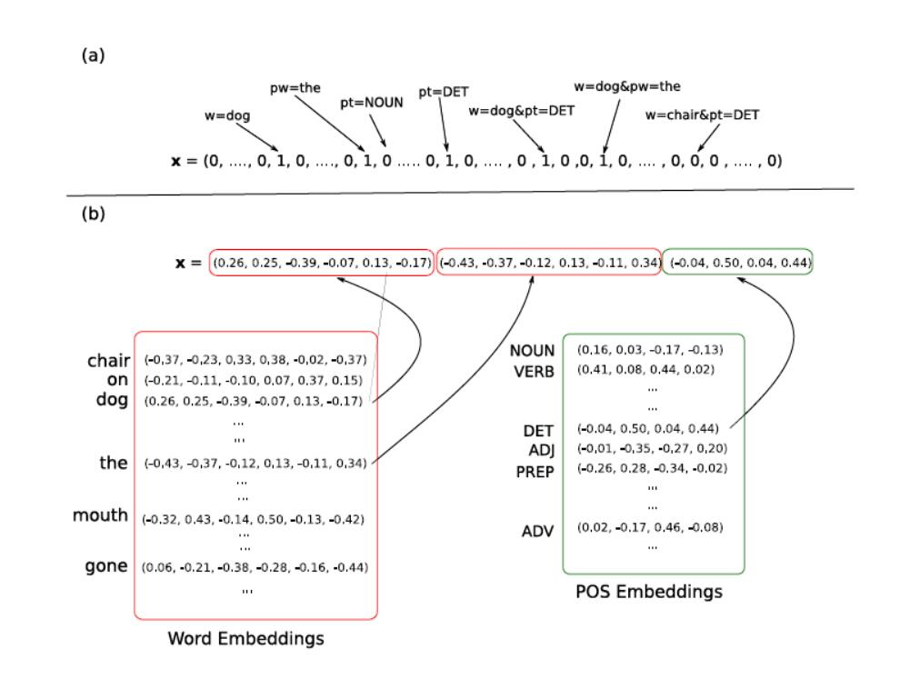

## 三、特征表示

在更深入地讨论网络结构之前，重要的是要注意如何表示特征。现在，我们可以将一个前馈神经网络想象为一个函数`NN(x)`，它将一个 $d_{in}$ 维向量`x`作为输入，并生成一个 $d_{out}$ 维输出向量。该函数通常用作分类器，将输入`x`分配为一个或多个 $d_{out}$ 类中的成员。该函数可能很复杂，并且几乎总是非线性的。这个函数的通用结构将在第 4 节讨论。在这里，我们关注输入`x`。在处理自然语言时，输入`x`编码单词，词性标签或其他语言信息之类的特征。当从稀疏输入线性模型转变为基于神经网络的模型时，也许最大的变化是不再将每个特征表示为唯一维度（即所谓的单热表示）并将它们表示为密集向量。也就是说，每个核心特征都被嵌入到一个`d`维空间中，并被表示为该空间中的一个向量。然后，可以像 NN 函数的其他参数一样训练嵌入（每个核心特征的向量表示）。图 1 显示了两种特征表示方法。

特征嵌入（每个特征的向量条目的值）被视为模型参数，需要与网络的其他组件一起训练。 训练（或获取）特征嵌入的方法将在后面讨论。 现在，考虑给定的特征嵌入。 

因此，基于前馈神经网络的 NLP 分类系统的一般结构是：

1.  提取一系列核心语言特征 $f_1, ..., f_k$，和输出类相关。

2.  对于每个感兴趣的特征 $f_i$，获取对应向量 $v(f_i)$

3.  组合向量（通过连接，求和，或者二者都有）。

4.  将`x`放进非线性分类器（前馈神经网络）

之后，输入的最大变化就是，从每个特征是它自己的维度的稀疏表示，变为每个特征都是一个向量的密集表示。 另一个区别是我们只提取核心特征而不是特征组合。 我们将简要阐述这些变化。

密集向量 vs 单热表示

将我们的特征表示为向量而不是唯一的 ID 有什么好处？ 我们是否应该始终将特征表示为密集向量？ 让我们考虑两种表示：

单热：每个特征是它自己的维度

+   单热向量的维度和不同特征的数量相同。
+   特征完全独立于其他特征。“word is 'dog'”的特征不相似于“word is 'thinking'”，“word is 'cat'”也一样。

密集：每个特征是 D 维向量

+   向量维度是`d`
+   相似特征拥有相似向量 -- 信息在相似特征之间共享

图 1：稀疏与密集的特征表示。 信息的两种编码：当前字是“dog”;前一个字是“the”；前一个词性是“DET”。（a）稀疏特征向量，每个维度代表一个特征，特征组合接收它们自己的维度，特征值是二进制的，维度非常高；（b）密集的，基于嵌入的特征向量。 每个核心特征表示为一个向量，每个特征对应多个输入向量条目，没有明确的特征组合编码，维度较低，特征向量映射来自嵌入表。

使用密集和低维向量的一个好处是计算：大多数神经网络工具包在高维稀疏向量中不能很好地发挥作用。 然而，这只是一个技术障碍，可以通过一些工程努力来解决。

密集表示的主要优点在于泛化能力：如果我们相信某些特征可能提供相似的线索，那么值得提供能够捕获这些相似性的表示。 例如，假设我们在训练过程中多次观察到“dog”这个词，但只观察了几次“cat”这个词，或者根本没有。 如果每个单词与它自己的维度相关联，“dog”的出现不会告诉我们有关“cat”出现的任何信息。 然而，在密集的向量表示中，学习到的“dog”向量可能类似于从“cat”学习到的向量，从而允许模型共享这两个事件之间的统计强度。 这个论点假设“好的”向量以某种方式提供给我们，第 5 节描述了获得这种向量表示的方法。
