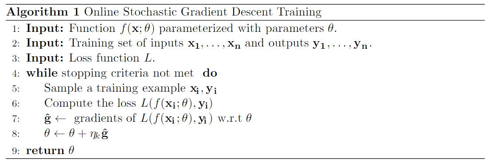

# 六、神经网络的训练

神经网络的训练是通过尝试使用基于梯度的方法，最小化训练集上的损失函数来完成的。 粗略地说，所有训练方法的原理都是重复计算数据集上的误差估计，计算误差的梯度，然后沿梯度方向移动参数。 如何计算误差估计，以及如何定义“在梯度方向上移动”，不同模型是不同的。 我们描述了基本算法，随机梯度下降（SGD），然后提到其他方法，带有用于进一步阅读的链接。 梯度计算是该方法的核心。 梯度可以使用计算图上的反向模式微分来有效自动计算 - 它是一种通用的算法框架，可以自动计算任何网络和损失函数的梯度。

## 6.1 随机梯度训练

训练神经网络的常用方法是使用随机梯度下降（SGD）算法（Bottou，2012; LeCun，Bottou，Orr，和 Muller，1998a）或其变体。SGD 是一种通用优化算法。 它接收参数为`θ`的损失函数`f`，和所需的输入输出。 然后，它尝试设置参数`θ`，使得相对于训练样本的`f`的损失很小。 该算法的工作原理如下：



该算法的目标是设置参数`θ`，来最小化训练集上的总损失$\sigma_{i=1}^n L(f(x_i; \theta), y_i)$。 它的工作原理是重复采样训练样本，并计算误差对于参数`θ`的梯度（第 7 行） - 假设输入和预期输出是固定的，并且损失被视为参数`θ`函数。然后在梯度方向上更新参数`θ`，通过学习速率`η`（第 8 行）来缩放。 对于设置学习率的进一步讨论，请参见第 6.3 节。

请注意，第 6 行中计算的误差基于单个训练示例，因此仅仅是对我们打算使其最小的，语料库范围的损失的粗略估计。 损失计算中的噪声可能导致梯度不准确。 减少这种噪声的常用方法是基于`m`个样本来估计误差和梯度。 这就上升为小批量 SGD 算法：


在第 6-9 行中，算法基于小批量估计语料库损失的梯度。 在循环之后，`g`包含梯度估计，并且参数`θ`朝着`g`更新。 小批量大小的大小可以从`m = 1`到`m = n`。 较高的值可以更好地估计语料库范围的梯度，而较小的值可以提供更多的更新，从而更快地收敛。 除了提高梯度估计的准确性之外，小批量算法有机会提高训练效率。对于适度大小的`m`，一些计算架构（即 GPU）可以高效并行实现行 6-9 中的计算。 学习率足够小的情况下，如果函数是凸的，SGD 可以保证收敛到全局最优。 然而，它也可以用于优化非凸函数，例如神经网络。 虽然不再保证找到全局最优，但据证明该算法是健壮的并且在实践中表现良好。

在训练神经网络时，参数化函数`f`是神经网络，参数`θ`是层间传递矩阵，偏置项，嵌入矩阵等等。梯度计算是 SGD 算法以及所有其他神经网络训练算法中的关键步骤。那么问题是，如何计算网络误差对参数的梯度。幸运的是，有一种简单的解法，形式为反向传播算法（Rumelhart，Hinton，&Williams，1986; Lecun，Bottou，Bengio，&Haffner，1998b）。反向传播算法是一个奇特的名称，指代使用链式法则计算复杂表达式的导数，同时缓存中间结果。更一般，爱说，反向传播算法是反向模式自动微分算法的特例（Neidinger，2010，Section 7），（Baydin，Pearlmutter，Radul，&Siskind，2015; Bengio，2012）。以下部分描述了反向模式自动微分算法，在计算图抽象的上下文中。

超越 SGD。虽然 SGD 算法可以并且通常确实产生了良好的结果，但也可以使用更先进的算法。 SGD + 动量（Polyak，1964）和 Nesterov 动量（Sutskever，Martens，Dahl，&Hinton，2013）算法是 SGD 的变体，其中累积先前的梯度并且影响当前的更新。 自适应学习算法包括 AdaGrad（Duchi，Hazan，&Singer，2011），AdaDelta（Zeiler，2012），RMSProp（Tieleman & Hinton，2012）和 Adam（Kingma & Ba，2014），旨在为每个小批量选择学习率， 有时基于每个坐标，学习速率调度的需要可能会减少。 对于这些算法的详细信息，请参阅原始论文或（Bengio等，2015，第 8.3 和 8.4 节）。 由于许多神经网络软件框架提供了这些算法的实现，因此尝试不同的变体很容易，有时候也是值得的。

## 6.2 计算图抽象

虽然可以手动计算网络的各种参数的梯度，并且在代码中实现它们，但是该过程是麻烦且容易出错的。 对于大多数情况，最好使用自动工具进行梯度计算（Bengio，2012）。 计算图抽象允许我们轻松地构造任意网络，评估给定输入的预测（正向传递），并计算任意标量损失相对于其参数（反向传递）的梯度。


计算图是任意数学计算的表示，如图。 它是有向无环图（DAG），其中节点对应于数学运算或变量（绑定），并且边对应于节点之间的中间值的流。 根据不同组件之间的依赖关系，图结构定义计算的顺序。 图是 DAG 而不是树，因为一个操作的结果可以是几个后续的输入。 考虑例如用于计算`(a ∗ b + 1) ∗ (a ∗ b + 2)`的图：


a * b的计算是共享的。 我们将自己局限于计算图连通的情况。由于神经网络本质上是一个数学表达式，它可以表示为计算图。

例如，图 3a 给出了具有 softmax 输出变换的 1 层 MLP 的计算图。 在我们的表示法中，椭圆形节点表示数学运算或函数，阴影矩形节点表示参数（绑定变量）。 网络的输入被视为常量，并且在没有周围节点的情况下绘制。 输入和参数节点没有传入边，输出节点没有传出边。 每个节点的输出是一个矩阵，其维度在节点上方标明。

该图是不完整的：没有指定输入，我们无法计算输出。图 3b 显示了 MLP 的完整图，它将三个单词作为输入，并预测第三个单词的词性标签的分布。 此图可用于预测，但不能用于训练，因为输出是矢量（不是标量），图并没有考虑正确答案或损失项。 最后，3c 中的图显示了特定训练示例的计算图，其中输入是“嵌入”单词“the”，“black”，“dog”，预期输出是“NOUN”（其索引为 5）。


图 3：MLP1 的计算图。（a）输入未绑定的图表。（b）带有具体输入的图表。（c）带有输入，预期输出和损失节点的图表。

一旦构建了图，就可以直接执行正向计算（计算结果）或反向计算（计算梯度），如下所示。 构建图表可能看起来令人生畏，但实际上使用专用软件库和 API 非常容易。

正向计算。正向传播计算图中节点的输出。 由于每个节点的输出，仅取决于它自身及其传入边，因此通过以拓扑顺序遍历节点，并在其前驱的输出已计算的情况下，计算每个节点的输出来计算所有节点的输出是很简单的。

更正式来讲，在 N 个节点的图中，我们根据它们的拓扑序将每个节点与关联到下标 i。 让`fi`为由节点`i`计算的函数（例如乘法和加法等）。 令`π(i)`为节点`i`的父节点，并且`π−1(i) = {j | i ∈ π(j)}`，为节点`i`的子节点（这些是`fi`的参数）。 用`v(i)`表示节点`i`的输出，即`fi`在`π-1(i)`输出值上的应用。 对于变量和输入节点，`fi`是常函数，`π−1(i)`是空的。 前向算法计算所有的值`v(i), i∈[1,N]`。


反向计算（导数，反向传播）。反向传播首先指定带有标量输出（1×1）节点`N`作为损失节点，并执行前向计算到该节点。 反向计算将根据该节点的值计算梯度。 用`d(i)`表示`∂N/∂i`。 反向传播算法用于计算所有节点`i`的值`d(i)`。反向传播填充表`d(i)`，像这样：


`∂fj/∂i`是`fj(π-1(j))`对于参数`i∈π-1(j)`的偏导数。该值取决于函数`fj`和参数的值`v(a1), ..., v(am)`（其中`a1, ..., am =π-1(j)`），在前向传递中计算。

因此，为了定义新的节点，需要定义两种方法：一种用于根据节点输入计算前向值`v(i)`，另一种用于为每个`x ∈ π−1(i)`计算每个`x∈π-1`的`∂fi/∂x`。

对于自动微分的更多信息，请参阅（Neidinger，2010，第7节），（Baydin等，2015）。 对于反向传播算法和计算图（也称为流图）的更深入讨论，请参阅（Bengio 等，2015，第 6.4 节），（Lecunet 等，1998b; Bengio，2012）。 对于流行的技术展示，请参阅 <http://colah.github.io/posts/2015-08-Backprop/> 上的 Chris Olah 的描述。

软件。几个软件包实现了计算图模型，包括 Theano [18]，Chainer [19]，penne [20] 和 CNN/pyCNN [21]。 所有这些软件包都支持所有基本组件（节点类型），用于定义各种神经网络体系结构，涵盖本教程中描述的结构，以及其他。 通过使用运算符重载，图的创建几乎是透明的。 该框架定义了一种表示图节点的类型（通常称为表达式），构造输入和参数的节点的方法，以及一组函数和数学运算，它们将表达式作为输入并产生更复杂的表达式。 例如，使用 pyCNN 框架从图（3c）创建计算图的 python 代码是：

```py
from pycnn import*
# model initialization.
model = Model()
model.add_parameters("W1", (20,150))
model.add_parameters("b1", 20)
model.add_parameters("W2", (17,20))
model.add_parameters("b2", 17)
model.add_lookup_parameters("words", (100, 50))

# Building the computation graph:
renew_cg() 
# create a new graph.
# Wrap the model parameters as graph-nodes.
W1 = parameter(model["W1"])
b1 = parameter(model["b1"])
W2 = parameter(model["W2"])
b2 = parameter(model["b2"])
def get_index(x): return 1
# Generate the embeddings layer.
vthe = lookup(model["words"], get_index("the"))
vblack = lookup(model["words"], get_index("black"))
vdog = lookup(model["words"], get_index("dog"))

# Connect the leaf nodes into a complete graph.
x = concatenate([vthe, vblack, vdog])
output = softmax(W2*(tanh(W1*x)+b1)+b2)
loss = -log(pick(output, 5))

loss_value = loss.forward()
loss.backward() 
# the gradient is computed
# and stored in the corresponding
# parameters.
```

大多数代码涉及各种初始化：第一个块定义模型参数，这些参数可以在不同的计算图之间共享（回想一下，每个图对应于一个特定的训练示例）。 第二个块将模型参数转换为图节点（表达式）类型。 第三个块检索用于嵌入输入单词的表达式。 最后，第四个块是图的创建位置。 请注意图的创建的透明程度 - 在图的创建和数学方式描述之间几乎存在一对一的对应关系。 最后一个块显示前向和后向传播。 其他软件框架遵循类似的模式。

Theano 自带计算图的优化编译器，既是祝福又是诅咒。 一方面，一旦编译完成，大型图就可以在 CPU 或 GPU 上高效运行，使其成为具有固定结构的大型图的理想选择，其中只有输入在实例之间变化。 但是，编译步骤本身可能成本很高，并且使得接口使用起来有点麻烦。 相比之下，其他软件包专注于构建大型动态计算图并在没有编译步骤的情况下“凭空”执行。 虽然执行速度可能与 Theano 的优化版本有关，但在使用第 10,12 节中描述的循环和递归网络以及第 8 节中描述的结构化预测设置时，这些软件包特别方便。
