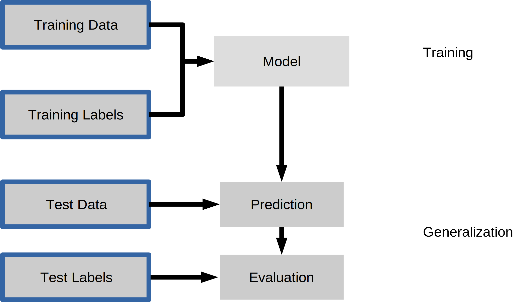

# 一、Python 机器学习简介

## 什么是机器学习？

机器学习是自动从数据中提取知识的过程，通常是为了预测新的，看不见的数据。一个典型的例子是垃圾邮件过滤器，用户将传入的邮件标记为垃圾邮件或非垃圾邮件。然后，机器学习算法从数据“学习”预测模型，数据区分垃圾邮件和普通电子邮件。该模型可以预测新电子邮件是否是垃圾邮件。

机器学习的核心是根据数据来自动化决策的概念，无需用户指定如何做出此决策的明确规则。

对于电子邮件，用户不提供垃圾邮件的单词或特征列表。相反，用户提供标记为垃圾邮件和非垃圾邮件的示例。

第二个核心概念是泛化。机器学习模型的目标是预测新的，以前没见过的数据。在实际应用中，将已标记的电子邮件标记为垃圾邮件，我们不感兴趣。相反，我们希望通过自动分类新的传入邮件来使用户更轻松。

数据通常作为数字的二维数组（或矩阵）展示给算法。 我们想要学习或做出决策的每个数据点（也称为样本或训练实例）表示为数字列表，即所谓的特征向量，其包含的特征表示这个点的属性。

稍后，我们将使用一个名为 Iris 的流行数据集 - 在许多其他数据集中。 Iris 是机器学习领域的经典基准数据集，包含来自 3 种不同物种的 150 种鸢尾花的测量值：Iris-Setosa（山鸢尾），Iris-Versicolor（杂色鸢尾）和 Iris-Virginica（弗吉尼亚鸢尾）。

| 物种 | 图像 |
| --- | --- |
| Iris Setosa |  |
| Iris Versicolor |  |
| Iris Virginica |  |

我们将每个花样本表示为数据阵列中的一行，列（特征）表示以厘米为单位的花测量值。 例如，我们可以用以下格式表示这个 Iris 数据集，包括 150 个样本和 4 个特征，一个`150×4`的二维数组或矩阵：

$\mathbf{X} = \begin{bmatrix}     x_{1}^{(1)} & x_{2}^{(1)} & x_{3}^{(1)} & \dots  & x_{4}^{(1)} \\     x_{1}^{(2)} & x_{2}^{(2)} & x_{3}^{(2)} & \dots  & x_{4}^{(2)} \\     \vdots & \vdots & \vdots & \ddots & \vdots \\     x_{1}^{(150)} & x_{2}^{(150)} & x_{3}^{(150)} & \dots  & x_{4}^{(150)} \end{bmatrix} $

（上标表示第`i`行，下标分别表示第`j`个特征。

我们今天将讨论两种机器学习：监督学习和无监督学习。

## 监督学习：分类和回归

在监督学习中，我们有一个数据集，由输入特征和所需输出组成的，例如垃圾邮件/非垃圾邮件示例。 任务是构建一个模型（或程序），它能够在给定特征集的情况下预测未见过的对象的所需输出。

一些更复杂的例子是：

+   通过望远镜给定物体的多色图像，确定该物体是星星，类星体还是星系。
+   给定一个人的照片，识别照片中的人物。
+   给定一个人观看的电影列表和他们对电影的个人评价，推荐他们想要的电影列表。
+   给定一个人的年龄，教育程度和职位，推断他们的薪水

这些任务的共同之处在于，存在与该对象相关联的一个或多个未知量，其需要从其他观察量确定。

监督学习进一步细分为两类，分类和回归：

在分类中，标签是离散的，例如“垃圾邮件”或“无垃圾邮件”。换句话说，它提供了类别之间的明确区分。此外，重要的是注意类标签是标称的，而不是序数变量。标称和序数变量都是类别变量的子类别。序数变量意味着顺序，例如，T 恤尺寸`XL> L> M> S`。相反，标称变量并不意味着顺序，例如，我们（通常）不能假设“橙色>蓝色>绿色”。
在回归中，标签是连续的，即浮点输出。例如，在天文学中，确定物体是星星，星系还是类星体的任务是分类问题：标签来自三个不同的类别。另一方面，我们可能希望根据这些观察来估计物体的年龄：这将是一个回归问题，因为标签（年龄）是一个连续的数量。

在监督学习中，在提供期望结果的训练集与需要根据它推断期望结果的测试集之间，总是存在区别。模型的学习使预测模型拟合训练集，我们使用测试集来评估其泛化表现。

### 无监督学习

在无监督学习中，没有与数据相关的期望输出。相反，我们有兴趣从给定的数据中提取某种形式的知识或模型。从某种意义上说，你可以将无监督学习视为从数据本身发现标签的一种手段。无监督学习通常难以理解和评估。

无监督学习包括降维，聚类和密度估计之类的任务。例如，在上面讨论的 Iris 数据中，我们可以使用无监督方法来确定显示数据结构的最佳测量值组合。我们将在下面看到，这种数据投影可用于在二维中可视化四维数据集。更多涉及无监督学习的问题是：

+   给定对遥远星系的详细观察，确定哪些特征或特征组合总结了最佳信息。
+   给定两个声源的混合（例如，一个人的谈话和一些音乐），将两者分开（这称为[盲源分离问题](http://en.wikipedia.org/wiki/Blind_signal_separation)）。
+   给定视频，隔离移动物体并相对于已看到的其他移动物体进行分类。
+   给定大量新闻文章，在这些文章中找到重复出现的主题。
+   给定一组图像，将相似的图像聚集在一起（例如，在可视化集合时对它们进行分组）

有时两者甚至可以合并：例如无监督学习可用于在异构数据中找到有用的特征，然后可以在监督框架内使用这些特征。

## （简化的）机器学习分类法

