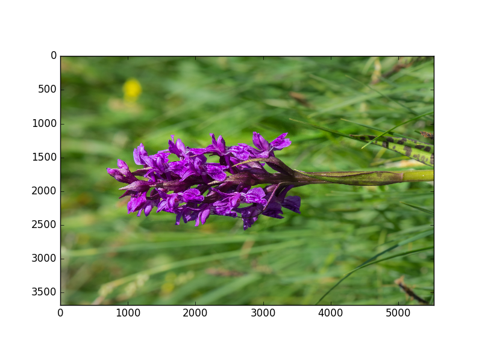
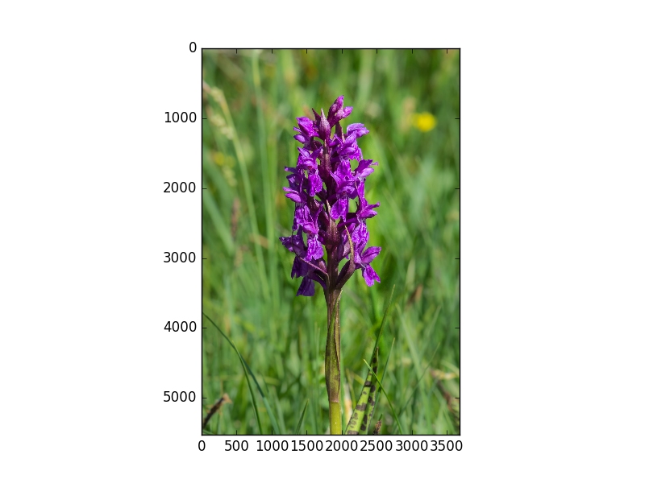
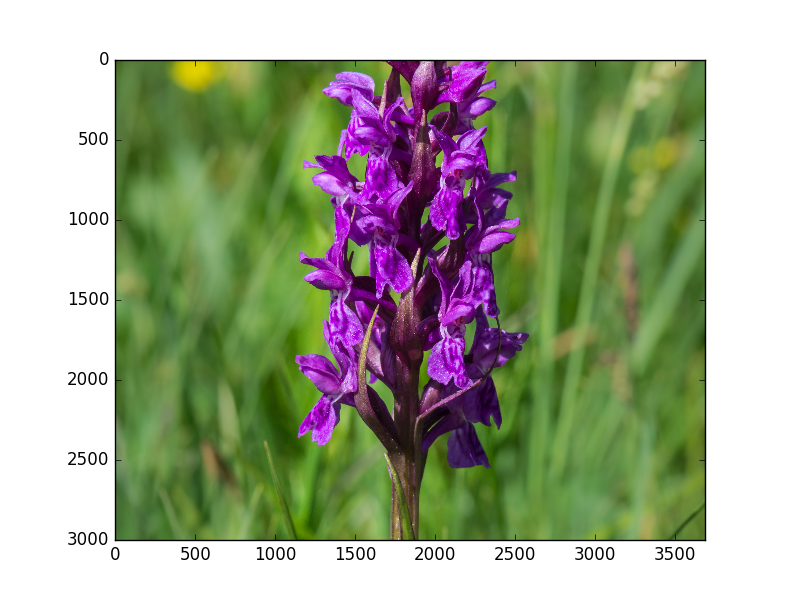

# 一、基础

## 变量

TensorFlow 是一种表示计算的方式，直到请求时才实际执行。 从这个意义上讲，它是一种延迟计算形式，它能够极大改善代码的运行：

+   更快地计算复杂变量
+   跨多个系统的分布式计算，包括 GPU。
+   减少了某些计算中的冗余

我们来看看实际情况。 首先，一个非常基本的 python 脚本：

```py
x = 35
y = x + 5
print(y)
```

这个脚本基本上只是“创建一个值为`35`的变量`x`，将新变量`y`的值设置为它加上`5`，当前为`40`，并将其打印出来”。 运行此程序时将打印出值`40`。 如果你不熟悉 python，请创建一个名为`basic_script.py`的新文本文件，并将该代码复制到该文件中。将其保存在你的计算机上并运行它：

```
python basic_script.py
```

请注意，路径（即`basic_script.py`）必须指向该文件，因此如果它位于`Code`文件夹中，则使用：

```
python Code/basic_script.py
```

此外，请确保已激活 Anaconda 虚拟环境。 在 Linux 上，这将使你的提示符看起来像：

```
(tensorenv)username@computername:~$
```

如果起作用，让我们将其转换为 TensorFlow 等价形式。

```py
import tensorflow as tf

x = tf.constant(35, name='x')
y = tf.Variable(x + 5, name='y')

print(y)
```

运行之后，你会得到一个非常有趣的输出，类似于`<tensorflow.python.ops.variables.Variable object at 0x7f074bfd9ef0>`。 这显然不是`40`的值。

原因在于，我们的程序实际上与前一个程序完全不同。 这里的代码执行以下操作：

+   导入`tensorflow`模块并将其命名为`tf`
+   创建一个名为`x`的常量值，并为其赋值`35`
+   创建一个名为`y`的变量，并将其定义为等式`x + 5`
+   打印`y`的等式对象

微妙的区别是，`y`没有像我们之前的程序那样，给出`x + 5`的当前值”。 相反，它实际上是一个等式，意思是“当计算这个变量时，取`x`的值（就像那样）并将它加上`5`”。 `y`值的计算在上述程序中从未实际执行。

我们来解决这个问题：

```py
import tensorflow as tf

x = tf.constant(35, name='x')
y = tf.Variable(x + 5, name='y')

model = tf.global_variables_initializer()

with tf.Session() as session:
    session.run(model)
    print(session.run(y))
```

我们删除了`print(y)`语句，而是创建了一个会话，并实际计算了`y`的值。这里有相当多的样板，但它的工作原理如下：

+   导入`tensorflow`模块并将其命名为`tf`
+   创建一个名为`x`的常量值，并为其赋值`35`
+   创建一个名为`y`的变量，并将其定义为等式`x + 5`
+   使用`tf.global_variables_initializer()`初始化变量（我们将在此详细介绍）
+   创建用于计算值的会话
+   运行第四步中创建的模型
+   仅运行变量`y`并打印出其当前值

上面的第四步是一些魔术发生的地方。在此步骤中，将创建变量之间的依赖关系的图。在这种情况下，变量`y`取决于变量`x`，并且通过向其添加`5`来转换它的值。请记住，直到第七步才计算该值，在此之前，仅计算等式和关系。

1）常量也可以是数组。预测此代码将执行的操作，然后运行它来确认：

```py
import tensorflow as tf


x = tf.constant([35, 40, 45], name='x')
y = tf.Variable(x + 5, name='y')


model = tf.global_variables_initializer()

with tf.Session() as session:
    session.run(model)
    print(session.run(y))
```

生成包含 10,000 个随机数的 NumPy 数组（称为`x`），并创建一个存储等式的变量。

$y = 5x^2 - 3x + 15$

你可以使用以下代码生成 NumPy 数组：

```py
import numpy as np
data = np.random.randint(1000, size=10000)
```

然后可以使用`data`变量代替上面问题 1 中的列表。 作为一般规则，NumPy 应该用于更大的列表/数字数组，因为它具有比列表更高的内存效率和更快的计算速度。 它还提供了大量的函数（例如计算均值），通常不可用于列表。

3）你还可以在循环更新的变量，稍后我们将这些变量用于机器学习。 看看这段代码，预测它会做什么（然后运行它来检查）：

```py
import tensorflow as tf


x = tf.Variable(0, name='x')

model = tf.global_variables_initializer()

with tf.Session() as session:
    session.run(model)
    for i in range(5):
        x = x + 1
        print(session.run(x))
```

4）使用上面（2）和（3）中的代码，创建一个程序，计算以下代码行的“滑动”平均值：`np.random.randint(1000)`。 换句话说，保持循环，并在每个循环中，调用`np.random.randint(1000)`一次，并将当前平均值存储在在每个循环中不断更新变量中。

5）使用 TensorBoard 可视化其中一些示例的图。 要运行 TensorBoard，请使用以下命令：`tensorboard --logdir=path/to/log-directory`。

```py
import tensorflow as tf

x = tf.constant(35, name='x')
print(x)
y = tf.Variable(x + 5, name='y')

with tf.Session() as session:
    merged = tf.summary.merge_all()
    writer = tf.summary.FileWriter("/tmp/basic", session.graph)
    model =  tf.global_variables_initializer()
    session.run(model)
    print(session.run(y))
```


要了解 Tensorboard 的更多信息，请访问我们的[可视化课程](http://learningtensorflow.com/Visualisation/)。

## 数组

在本教程中，我们将处理图像，以便可视化数组的更改。 数组是强大的结构，我们在前面的教程中简要介绍了它。 生成有趣的数组可能很困难，但图像提供了很好的选择。

首先，下载此图像到你的计算机（右键单击，并寻找选项“图片另存为”）。


此图片来自[维基共享的用户 Uoaei1](https://commons.wikimedia.org/wiki/Main_Page#/media/File:Dactylorhiza_majalis_Spechtensee_01.JPG)。

要处理图像，我们需要`matplotlib`。 我们还需要`pillow`库，它会覆盖已弃用的 PIL 库来处理图像。 你可以使用 Anaconda 的安装方法在你的环境中安装它们：

```
conda install matplotlib pillow
```

要加载图像，我们使用`matplotlib`的图像模块：

```py
import matplotlib.image as mpimg
import os
# 首先加载图像
dir_path = os.path.dirname(os.path.realpath(__file__))
filename = dir_path + "/MarshOrchid.jpg"

# 加载图像
image = mpimg.imread(filename)

# 打印它的形状
print(image.shape)
```

上面的代码将图像作为 NumPy 数组读入，并打印出大小。 请注意，文件名必须是下载的图像文件的完整路径（绝对路径或相对路径）。

你会看到输出，即`(5528, 3685, 3)`。 这意味着图像高 5528 像素，宽 3685 像素，3 种颜色“深”。

你可以使用`pyplot`查看当前图像，如下所示：

```py
import matplotlib.pyplot as plt
plt.imshow(image)
plt.show()
```

现在我们有了图像，让我们使用 TensorFlow 对它进行一些更改。

## 几何操作

我们将要执行的第一个转换是转置，将图像逆时针旋转 90 度。 完整的程序如下，其中大部分是你见过的。

```py
import tensorflow as tf
import matplotlib.image as mpimg
import matplotlib.pyplot as plt
import os

# 再次加载图像
dir_path = os.path.dirname(os.path.realpath(__file__))
filename = dir_path + "/MarshOrchid.jpg"
image = mpimg.imread(filename)

# 创建 TF 变量
x = tf.Variable(image, name='x')

model = tf.global_variables_initializer()

with tf.Session() as session:
    x = tf.transpose(x, perm=[1, 0, 2])
    session.run(model)
    result = session.run(x)


plt.imshow(result)
plt.show()
```

转置操作的结果：



新东西是这一行：

```py
x = tf.transpose(x, perm=[1, 0, 2])
```

该行使用 TensorFlow 的`transpose`方法，使用`perm`参数交换轴 0 和 1（轴 2 保持原样）。

我们将要做的下一个操作是（左右）翻转，将像素从一侧交换到另一侧。 TensorFlow 有一个称为`reverse_sequence`的方法，但签名有点奇怪。 这是文档所说的内容（来自[该页面](https://tensorflow.google.cn/api_docs/python/tf/reverse_sequence)）：

> 反转可变长度切片。
> 
> 这个操作首先沿着维度`batch_axis`对`input`却偏，并且对于每个切片`i`，沿着维度`seq_axis`反转第一个`seq_lengths [i]`元素。
> 
> `seq_lengths`的元素必须满足`seq_lengths [i] <= input.dims [seq_dim]`，而`seq_lengths`必须是长度为`input.dims [batch_dim]`的向量。
> 
> 然后，输入切片`i`给出了沿维度`batch_axis`的输出切片`i`，其中第一个`seq_lengths [i]`切片沿着维度`seq_axis`被反转。

对于这个函数，最好将其视为：

+   根据`batch_dim`迭代数组。 设置`batch_dim = 0`意味着我们遍历行（从上到下）。
+   对于迭代中的每个项目
    +   对第二维切片，用`seq_dim`表示。 设置`seq_dim = 1`意味着我们遍历列（从左到右）。
    +   迭代中第`n`项的切片由`seq_lengths`中的第`n`项表示

让我们实际看看它：

```py
import numpy as np
import tensorflow as tf
import matplotlib.image as mpimg
import matplotlib.pyplot as plt
import os
# First, load the image again
dir_path = os.path.dirname(os.path.realpath(__file__))
filename = dir_path + "/MarshOrchid.jpg"
image = mpimg.imread(filename)
height, width, depth = image.shape

# Create a TensorFlow Variable
x = tf.Variable(image, name='x')

model = tf.global_variables_initializer()

with tf.Session() as session:
    x = tf.reverse_sequence(x, [width] * height, 1, batch_dim=0)
    session.run(model)
    result = session.run(x)

print(result.shape)
plt.imshow(result)
plt.show()
```

新东西是这一行：

```py
x = tf.reverse_sequence(x, np.ones((height,)) * width, 1, batch_dim=0)
```

它从上到下（沿着它的高度）迭代图像，并从左到右（沿着它的宽度）切片。 从这里开始，它选取大小为`width`的切片，其中`width`是图像的宽度。

> 译者注：
> 
> 还有两个函数用于实现切片操作。一个是[`tf.reverse`](https://tensorflow.google.cn/api_docs/python/tf/manip/reverse)，另一个是张量的下标和切片运算符（和 NumPy 用法一样）。

代码`np.ones((height,)) * width`创建一个填充值`width`的 NumPy 数组。 这不是很有效！ 不幸的是，在编写本文时，似乎此函数不允许你仅指定单个值。

“翻转”操作的结果：



1）将转置与翻转代码组合来顺时针旋转。

2）目前，翻转代码（使用`reverse_sequence`）需要预先计算宽度。 查看`tf.shape`函数的文档，并使用它在会话中计算`x`变量的宽度。

3）执行“翻转”，从上到下翻转图像。

4）计算“镜像”，复制图像的前半部分，（左右）翻转然后复制到后半部分。

## 占位符

到目前为止，我们已经使用`Variables`来管理我们的数据，但是有一个更基本的结构，即占位符。 占位符只是一个变量，我们将在以后向它分配数据。 它允许我们创建我们的操作，并构建我们的计算图，而不需要数据。 在 TensorFlow 术语中，我们随后通过这些占位符，将数据提供给图。

```py
import tensorflow as tf

x = tf.placeholder("float", None)
y = x * 2

with tf.Session() as session:
    result = session.run(y, feed_dict={x: [1, 2, 3]})
    print(result)
```

这个例子与我们之前的例子略有不同，让我们分解它。

首先，我们正常导入`tensorflow`。然后我们创建一个名为`x`的`placeholder`，即我们稍后将存储值的内存中的位置。

然后，我们创建一个`Tensor`，它是`x`乘以 2 的运算。注意我们还没有为`x`定义任何初始值。

我们现在定义了一个操作（`y`），现在可以在会话中运行它。我们创建一个会话对象，然后只运行`y`变量。请注意，这意味着，如果我们定义了更大的操作图，我们只能运行图的一小部分。这个子图求值实际上是 TensorFlow 的一个卖点，而且许多其他类似的东西都没有。

运行`y`需要了解`x`的值。我们在`feed_dict`参数中定义这些来运行。我们在这里声明`x`的值是`[1,2,3]`。我们运行`y`，给了我们结果`[2,4,6]`。

占位符不需要静态大小。让我们更新我们的程序，让`x`可以接受任何长度。将`x`的定义更改为：

```py
x = tf.placeholder("float", None)
```

现在，当我们在`feed_dict`中定义`x`的值时，我们可以有任意维度的值。 代码应该仍然有效，并给出相同的答案，但现在它也可以处理`feed_dict`中的任意维度的值。

占位符也可以有多个维度，允许存储数组。 在下面的示例中，我们创建一个 3 乘 2 的矩阵，并在其中存储一些数字。 然后，我们使用与以前相同的操作，来逐元素加倍数字。

```py
import tensorflow as tf

x = tf.placeholder("float", [None, 3])
y = x * 2

with tf.Session() as session:
    x_data = [[1, 2, 3],
              [4, 5, 6],]
    result = session.run(y, feed_dict={x: x_data})
    print(result)
```

占位符的第一个维度是`None`，这意味着我们可以有任意数量的行。 第二个维度固定为 3，这意味着每行需要有三列数据。

我们可以扩展它来接受任意数量的`None`维度。 在此示例中，我们加载来自上一课的图像，然后创建一个存储该图像切片的占位符。 切片是图像的 2D 片段，但每个“像素”具有三个分量（红色，绿色，蓝色）。 因此，对于前两个维度，我们需要`None`，但是对于最后一个维度，需要 3（或`None`也能用）。 然后，我们使用 TensorFlow 的切片方法从图像中取出一个子片段来操作。

```py
import tensorflow as tf
import matplotlib.image as mpimg
import matplotlib.pyplot as plt
import os

# First, load the image again
dir_path = os.path.dirname(os.path.realpath(__file__))
filename = dir_path + "/MarshOrchid.jpg"
raw_image_data = mpimg.imread(filename)

image = tf.placeholder("uint8", [None, None, 3])
slice = tf.slice(image, [1000, 0, 0], [3000, -1, -1])

with tf.Session() as session:
    result = session.run(slice, feed_dict={image: raw_image_data})
    print(result.shape)

plt.imshow(result)
plt.show()
```

> 译者注：使用下标和切片运算符也可以实现切片。

结果是图像的子片段：



1）在官方文档中查看 TensorFlow 中的[其他数组函数](https://www.tensorflow.com/versions/master/api_docs/python/array_ops.html#slicing-and-joining)。

2）将图像分成四个“角”，然后再将它拼在一起。

3）将图像转换为灰度。 一种方法是只采用一个颜色通道并显示。 另一种方法是将三个通道的平均值作为灰色。

## 交互式会话

现在我们有了一些例子，让我们更仔细地看看发生了什么。

正如我们之前已经确定的那样，TensorFlow 允许我们创建操作和变量图。这些变量称为张量，表示数据，无论是单个数字，字符串，矩阵还是其他内容。张量通过操作来组合，整个过程以图来建模。

首先，确保激活了`tensorenv`虚拟环境，一旦激活，请输入`conda install jupyter`来安装`jupter books`。

然后，运行`jupyter notebook`以启动 Jupyter Notebook（以前称为 IPython Notebook）的浏览器会话。 （如果你的浏览器没有打开，请打开它并在浏览器的地址栏中输入`localhost:8888`。）

单击`New`（新建），然后单击`Notebooks`（笔记本）下的`Python 3`（Python 3）。这将启动一个新的浏览器选项卡。通过单击顶部的`Untitled`（无标题）为该笔记本命名，并为其命名（我使用`Interactive TensorFlow`）。

> 如果你以前从未使用过 Jupyter 笔记本（或 IPython 笔记本），请查看[此站点](http://opentechschool.github.io/python-data-intro/core/notebook.html)来获得简介。

接下来，和以前一样，让我们创建一个基本的 TensorFlow 程序。 一个主要的变化是使用`InteractiveSession`，它允许我们运行变量，而不需要经常引用会话对象（减少输入！）。 下面的代码块分为不同的单元格。 如果你看到代码中断，则需要先运行上一个单元格。 此外，如果你不自信，请确保在运行之前将给定块中的所有代码键入单元格。

```py
import tensorflow as tf

session = tf.InteractiveSession()

x = tf.constant(list(range(10)))
```
在这段代码中，我们创建了一个`InteractiveSession`，然后定义一个常量值，就像一个占位符，但具有设置的值（不会改变）。 在下一个单元格中，我们可以求解此常量并打印结果。

```py
print(x.eval())
```

下面我们关闭打开的会话。

```py
session.close()
```

关闭会话非常重要，并且很容易忘记。 出于这个原因，我们在之前的教程中使用`with`关键字来处理这个问题。 当`with`块完成执行时，会话将被关闭（如果发生错误也会发生这种情况 - 会话仍然关闭）。

现在让我们来看更大的例子。 在这个例子中，我们将使用一个非常大的矩阵并对其进行计算，跟踪何时使用内存。 首先，让我们看看我们的 Python 会话当前使用了多少内存：

```py
import resource
print("{} Kb".format(resource.getrusage(resource.RUSAGE_SELF).ru_maxrss))
```

在我的系统上，运行上面的代码之后，使用了 78496 千字节。 现在，创建一个新会话，并定义两个矩阵：

```py
import numpy as np
session = tf.InteractiveSession()

X = tf.constant(np.eye(10000))
Y = tf.constant(np.random.randn(10000, 300))
```

让我们再看一下我们的内存使用情况：

```py
print("{} Kb".format(resource.getrusage(resource.RUSAGE_SELF).ru_maxrss))
```

在我的系统上，内存使用率跃升至 885,220 Kb - 那些矩阵很大！

现在，让我们使用`matmul`将这些矩阵相乘：

```py
Z = tf.matmul(X, Y)
```

如果我们现在检查我们的内存使用情况，我们发现没有使用更多的内存 - 没有实际的`Z`的计算。 只有当我们求解操作时，我们才真正计算。 对于交互式会话，你可以使用`Z.eval()`，而不是运行`session.run(Z)`。 请注意，你不能总是依赖`.eval()`，因为这是使用“默认”会话的快捷方式，不一定是你要使用的会话。

如果你的计算机比较低级（例如，ram 低于 3Gb），那么不要运行此代码 - 相信我！

```py
Z.eval()
```

你的计算机会考虑很长一段时间，因为现在它才实际执行这些矩阵相乘。 之后检查内存使用情况会发现此计算已经发生，因为它现在使用了接近 3Gb！

```py
print("{} Kb".format(resource.getrusage(resource.RUSAGE_SELF).ru_maxrss))
```

别忘了关闭你的会话！

```py
session.close()
```

注意：我建议使用新的 Jupyter Notebook，因为上面的示例代码可能会被意外再次执行，可能导致计算机崩溃！

1）创建一个整数值的大矩阵（至少 10,000,000）（例如，使用 NumPy 的`randint`函数）。 创建矩阵后检查内存使用情况。 然后，使用 TensorFlow 的`to_float`函数将矩阵转换为浮点值。 再次检查内存使用情况，看到内存使用量增加超过两倍。 “加倍”是由创建矩阵的副本引起的，但是“额外增加”的原因是什么？ 执行此实验后，你可以使用此代码显示图像。

```py
from PIL import Image
from io import BytesIO

# 从字符串读取数据
im = Image.open(BytesIO(result))
im
```

> 提示：确保在每一步之后仔细测量内存使用情况，因为只是导入 TensorFlow 就会使用相当多的内存。

2）使用 TensorFlow 的图像函数将上一个教程中的图像（或其他图像）转换为 JPEG 并记录内存使用情况。
