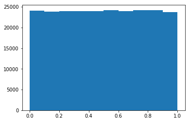
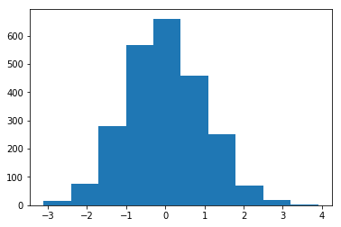
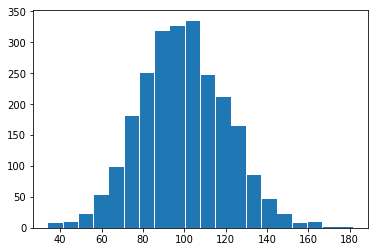

# 二、线性模型

## 广播

当我们操作不同维度的数组时，它们可以以不同的方式组合，无论是逐元素还是通过广播。

让我们从头开始，构建更复杂的例子。 在下面的示例中，我们有表示单个数字的 TensorFlow 常量。

```py
import tensorflow as tf

a = tf.constant(3, name='a')

with tf.Session() as session:
    print(session.run(a))
```

这里没什么惊喜！ 我们也可以进行计算，例如将其加上另一个数字：

```py
a = tf.constant(3, name='a')
b = tf.constant(4, name='b')
add_op = a + b

with tf.Session() as session:
    print(session.run(add_op))
```

让我们将这个概念扩展到一个数字列表。 首先，让我们创建一个包含三个数字的列表，然后创建另一个数字列表：

```py
a = tf.constant([1, 2, 3], name='a')
b = tf.constant([4, 5, 6], name='b')
add_op = a + b

with tf.Session() as session:
    print(session.run(add_op))
```

这称为逐元素操作，其中依次考虑每个列表中的元素，将它们相加，然后合并结果。

如果我们将这个列表和仅仅一个数字相加，会发生什么？

```py
a = tf.constant([1, 2, 3], name='a')
b = tf.constant(4, name='b')
add_op = a + b

with tf.Session() as session:
    print(session.run(add_op))
```

这是你所期望的吗？ 这被称为广播操作。 我们的主要对象引用是`a`，它是一个数字列表，也称为数组或一维向量。 与单个数字（称为标量）相加会产生广播操作，其中标量将与列表的每个元素相加。

现在让我们看一个扩展，它是一个二维数组，也称为矩阵。 这个额外的维度可以被认为是“列表的列表”。 换句话说，列表是标量的组合，矩阵是列表的列表。

也就是说，矩阵上的操作如何工作？

```py
a = tf.constant([[1, 2, 3], [4, 5, 6]], name='a')
b = tf.constant([[1, 2, 3], [4, 5, 6]], name='b')
add_op = a + b

with tf.Session() as session:
    print(session.run(add_op))
```

这是逐元素的。 如果我们加上一个标量，结果是可以预测的：

```py
a = tf.constant([[1, 2, 3], [4, 5, 6]], name='a')
b = tf.constant(100, name='b')
add_op = a + b

with tf.Session() as session:
    print(session.run(add_op))
```

事情开始变得棘手。 如果我们将一维数组与二维矩阵相加会发生什么？

```py
a = tf.constant([[1, 2, 3], [4, 5, 6]], name='a')
b = tf.constant([100, 101, 102], name='b')
add_op = a + b

with tf.Session() as session:
    print(session.run(add_op))
```

在这种情况下，数组被广播为矩阵的形状，导致数组与矩阵的每一行相加。 使用此术语，矩阵是行的列表。

如果我们不想要这个，而是想将矩阵的列与`b`相加呢？

```py
a = tf.constant([[1, 2, 3], [4, 5, 6]], name='a')
b = tf.constant([100, 101,], name='b')
add_op = a + b

with tf.Session() as session:
    print(session.run(add_op))
```

这不起作用，因为 TensorFlow 试图按照行广播。 它不能这样做，因为`b`中的值的数量（2）与每行中的标量数量（3）不同。

我们可以通过从列表中创建一个新矩阵来执行此操作。

```py
a = tf.constant([[1, 2, 3], [4, 5, 6]], name='a')
b = tf.constant([[100], [101]], name='b')
add_op = a + b

with tf.Session() as session:
    print(session.run(add_op))
```

这里发生了什么？ 要理解这一点，让我们看一下矩阵形状。

```py
a.shape
    TensorShape([Dimension(2), Dimension(3)])
b.shape
    TensorShape([Dimension(2), Dimension(1)])
```

你可以从这两个示例中看到`a`有两个维度，第一个大小为 2，第二个大小为 3。换句话说，它有两行，每行有三个标量。

我们的常数`b`也有两个维度，两行，每行一个标量。如果有一行两个标量，这与列表不同，也与矩阵不同。

由于形状在第一维匹配，而第二维不匹配的事实，广播发生在列而不是行中。 广播规则的更多信息请参见[此处](https://www.tensorflow.org/versions/master/experimental/xla/broadcasting)。

创建一个三维矩阵。 如果将其与标量，数组或矩阵相加，会发生什么？
使用`tf.shape`（这是一个操作）在图的操作期间获得常量的形状。
考虑更高维矩阵的用例。 换句话说，在哪里你可能需要 4D 矩阵，甚至是 5D 矩阵？ 提示：考虑集合而不是单个对象。

## 随机性

机器学习模型是许多变量的复杂集合，但必须经过训练才能找到好的值。这也意味着必须将这些“权重”设置为初始值。一种选择是从所有权重为零开始。但是，这会在算法上引起问题 - 基本上，错误的梯度无法修复错误。相反，我们经常将这些权重设置为随机值。然后，模型学习并调整。

TensorFlow 有许多用于生成随机数的内置方法。这包括我们熟悉的分布，如“均匀”，以及你可能听说过的其他分布，如“正态”分布。均匀分布就像你掷骰子时得到的东西那样 - 有一组值，它们都是等可能的。正态分布是统计课程中教授的标准，其中数据具有更可能的平均值，以及围绕它的“钟形”曲线。我们将看到的，其他的也包括在内。

在本节中，我们将创建一个基本的辅助函数，它只运行一个 TensorFlow 变量。这个小函数非常有用！它创建一个会话，初始化变量并为我们运行它。它仅限于单个变量，因此对于较大的程序可能没有用。

```py
import tensorflow as tf

def run_variable(variable):
    tf.initialize_all_variables()
    with tf.Session() as sess:
        return sess.run(variable)
```

希望现在这对你来说都很熟悉。 如果没有，请再看看第一章，开始吧。

让我们从一个基本的分布开始，均匀分布。

```py
my_distribution = tf.random_uniform((6, 4), seed=42)
uniform = run_variable(my_distribution)
```

这为我们提供了一个 6 乘 4 的张量（随机值的更多信息，请参阅上一节）。为了可视化，我们可以使用直方图：

```py
from matplotlib import pyplot as plt

plt.hist(uniform.flatten())
plt.show()
```

请注意，如果你使用的是 Jupyter 笔记本，请使用`%matplotlib inline`并删除`plt.show()`行。

所得图像显示了图片，虽然还不是很清楚......


此直方图显示可能的值介于 0 和 1 之间。每个值应该是等可能的，但它看起来并不是那样。 原因是我们只选择了少量的值。 如果我们增加数组的大小，它会变得更加均匀。

```py
large_normal = tf.random_uniform((600, 400), seed=42)
large_uniform = run_variable(large_normal)

plt.hist(large_uniform.flatten())
plt.show()
```



更均匀了！

如果你没有任何其他信息，对于在机器学习模型中初始化权重，均匀分布非常有用。 它也是一个“有界”分布，它具有设定的最小值和最大值，随机值不能超出该范围。 要更改范围，例如更改为 0 和 10，请乘以范围并添加最小值。 在课程结束时有一个练习。

另一种常用的分布是正态分布，在 TensorFlow 中实现为`random_normal`函数：

```py
distribution = tf.random_normal((600, 4), seed=42)
normal = run_variable(distribution)
plt.hist(normal.flatten())
plt.show()
```



默认情况下，此分布的平均值约为 0，标准差为 1。这些值不受限制，但越来越不可能偏离平均值，标准差设置了可能性减小的速率。 在实践中，大约 60% 的值落在距离平均值一个标准差的“半径”内，并且 99% 落在 4 个标准差内。

均值和标准差是`random_normal`函数的参数。 例如，身高可近似建模为正态分布，平均值约为 170cm，标准差约为 15cm。

```py
distribution = tf.random_normal((10000,), seed=42, mean=170, stddev=15)
normal = run_variable(distribution)
plt.hist(normal.flatten())
plt.show()
```


到目前为止，我们的直方图使用`matplotlib`生成。 我们也可以使用 TensorFlow 来创建它们！`histogram_fixed_width`函数接受值的列表（如我们的随机值），范围和要计算的桶数。 然后计算每个桶的范围内有多少个值，并将结果作为数组返回。

```py
import numpy as np
bins = tf.histogram_fixed_width(normal, (normal.min(), normal.max()), nbins=20)
histogram_bins = run_variable(bins)
x_values = np.linspace(normal.min(), normal.max(), len(histogram_bins))
plt.bar(x_values, histogram_bins,)
```

在`plt.bar`调用中，我们再次手动生成`bin`值，然后使用条形图将这些值绘制为`x`值，并使用`histogram_bins`作为高度。


这是正确的，但看起来不对。 直方图的值在那里，但宽度非常窄（我们的箱桶仅由单个值表示）。 我们来解决这个问题：

```py
bar_width = (normal.max() - normal.min()) / len(histogram_bins)
plt.bar(x_values, histogram_bins, width=bar_width)
```



+   使用云军分布建模单次掷骰子。 绘制结果来确保其符合你的期望
+   使用单个图中的纯 TensorFlow 调用替换本课程的最后一个代码块。 换句话说，使用 TensorFlow 概念来替换`.min()`,`.max()`和`len`调用。 只有绘图在没有 TensorFlow 的情况下进行！
