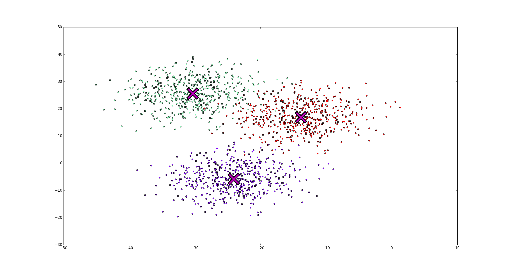

# 三、学习

## 聚类和 KMeans

我们现在冒险进入我们的第一个应用，即使用 k-means 算法进行聚类。 聚类是一种数据挖掘练习，我们获取大量数据并找到彼此相似的点的分组。 K-means 是一种非常善于在许多类型的数据集中查找簇的算法。

对于簇和 k-means的 更多信息，请参阅 [k-means 算法的 scikit-learn 文档](http://scikit-learn.org/stable/modules/clustering.html#k-means)或观看[此视频](https://www.youtube.com/embed/_aWzGGNrcic)。

### 生成样本

首先，我们需要生成一些样本。 我们可以随机生成样本，但这可能会给我们提供非常稀疏的点，或者只是一个大分组 - 对于聚类来说并不是非常令人兴奋。

相反，我们将从生成三个质心开始，然后在该点周围随机选择（具有正态分布）。 首先，这是一个执行此操作的方法

```py
import tensorflow as tf
import numpy as np


def create_samples(n_clusters, n_samples_per_cluster, n_features, embiggen_factor, seed):
    np.random.seed(seed)
    slices = []
    centroids = []
    # 为每个簇创建样本
    for i in range(n_clusters):
        samples = tf.random_normal((n_samples_per_cluster, n_features),
                                   mean=0.0, stddev=5.0, dtype=tf.float32, seed=seed, name="cluster_{}".format(i))
        current_centroid = (np.random.random((1, n_features)) * embiggen_factor) - (embiggen_factor/2)
        centroids.append(current_centroid)
        samples += current_centroid
        slices.append(samples)
    # 创建一个大的“样本”数据集
    samples = tf.concat(slices, 0, name='samples')
    centroids = tf.concat(centroids, 0, name='centroids')
    return centroids, samples
```

这种方法的工作方式是随机创建`n_clusters`个不同的质心（使用`np.random.random((1, n_features))`）并将它们用作`tf.random_normal`的质心。 `tf.random_normal`函数生成正态分布的随机值，然后我们将其添加到当前质心。 这会在该形心周围创建一些点。 然后我们记录质心（`centroids.append`）和生成的样本（`slices.append(samples)`）。 最后，我们使用`tf.concat`创建“一个大样本列表”，并使用`tf.concat`将质心转换为 TensorFlow 变量。

将`create_samples`方法保存在名为`functions.py`的文件中，允许我们为这个（以及下一个！）课程，将这些方法导入到我们的脚本中。 创建一个名为`generate_samples.py`的新文件，其中包含以下代码：

```py
import tensorflow as tf
import numpy as np

from functions import create_samples

n_features = 2
n_clusters = 3
n_samples_per_cluster = 500
seed = 700
embiggen_factor = 70

np.random.seed(seed)

centroids, samples = create_samples(n_clusters, n_samples_per_cluster, n_features, embiggen_factor, seed)

model = tf.global_variables_initializer()
with tf.Session() as session:
    sample_values = session.run(samples)
    centroid_values = session.run(centroids)
```

这只是设置了簇和特征的数量（我建议将特征的数量保持为 2，以便我们以后可以可视化它们），以及要生成的样本数。 增加`embiggen_factor`将增加簇的“散度”或大小。 我在这里选择了一个提供良好学习机会的值，因为它可以生成视觉上可识别的集群。

为了使结果可视化，我们使用`matplotlib`创建绘图函数。 将此代码添加到`functions.py`：

```py
def plot_clusters(all_samples, centroids, n_samples_per_cluster):
    import matplotlib.pyplot as plt
    # 绘制出不同的簇
    # 为每个簇选择不同的颜色
    colour = plt.cm.rainbow(np.linspace(0,1,len(centroids)))
    for i, centroid in enumerate(centroids):
        # 为给定簇抓取样本，并用新颜色绘制出来
        samples = all_samples[i*n_samples_per_cluster:(i+1)*n_samples_per_cluster]
        plt.scatter(samples[:,0], samples[:,1], c=colour[i])
        # 还绘制质心
        plt.plot(centroid[0], centroid[1], markersize=35, marker="x", color='k', mew=10)
        plt.plot(centroid[0], centroid[1], markersize=30, marker="x", color='m', mew=5)
     plt.show()
```

所有这些代码都是使用不同的颜色绘制每个簇的样本，并在质心位置创建一个大的红色`X`。 质心提供为参数，稍后会很方便。

更新`generate_samples.py`，通过将`import plot_clusters`添加到文件顶部来导入此函数。 然后，将这行代码添加到底部：

```py
plot_clusters(sample_values, centroid_values, n_samples_per_cluster)
```

运行`generate_samples.py`现在应该提供以下绘图：



### 初始化

k-means 算法从初始质心的选择开始，初始质心只是数据中实际质心的随机猜测。 以下函数将从数据集中随机选择多个样本作为此初始猜测：

```py
def choose_random_centroids(samples, n_clusters):
    # 第 0 步：初始化：选择 n_clusters 个随机点
    n_samples = tf.shape(samples)[0]
    random_indices = tf.random_shuffle(tf.range(0, n_samples))
    begin = [0,]
    size = [n_clusters,]
    size[0] = n_clusters
    centroid_indices = tf.slice(random_indices, begin, size)
    initial_centroids = tf.gather(samples, centroid_indices)
    return initial_centroids
```

这段代码首先为每个样本创建一个索引（使用`tf.range(0, n_samples)`，然后随机打乱它。从那里，我们使用`tf.slice`选择固定数量（`n_clusters`）的索引。这些索引与我们的初始质心相关，然后使用`tf.gather`组合在一起形成我们的初始质心数组。

将这个新的`choose_random_centorids`函数添加到`functions.py`中，并创建一个新脚本（或更新前一个脚本），写入以下内容：

```py
import tensorflow as tf
import numpy as np

from functions import create_samples, choose_random_centroids, plot_clusters

n_features = 2
n_clusters = 3
n_samples_per_cluster = 500
seed = 700
embiggen_factor = 70

centroids, samples = create_samples(n_clusters, n_samples_per_cluster, n_features, embiggen_factor, seed)
initial_centroids = choose_random_centroids(samples, n_clusters)

model = tf.global_variables_initializer()
with tf.Session() as session:
    sample_values = session.run(samples)
    updated_centroid_value = session.run(initial_centroids)

plot_clusters(sample_values, updated_centroid_value, n_samples_per_cluster)
```

这里的主要变化是我们为这些初始质心创建变量，并在会话中计算其值。 然后，我们将初始猜测绘制到`plot_cluster`，而不是用于生成数据的实际质心。

运行此操作会将得到与上面类似的图像，但质心将处于随机位置。 尝试运行此脚本几次，注意质心移动了很多。

### 更新质心

在开始对质心位置进行一些猜测之后，然后 k-means 算法基于数据更新那些猜测。 该过程是为每个样本分配一个簇号，表示它最接近的质心。 之后，将质心更新为分配给该簇的所有样本的平均值。 以下代码处理分配到最近的簇的步骤：

```py
def assign_to_nearest(samples, centroids):
    # 为每个样本查找最近的质心

    # START from http://esciencegroup.com/2016/01/05/an-encounter-with-googles-tensorflow/
    expanded_vectors = tf.expand_dims(samples, 0)
    expanded_centroids = tf.expand_dims(centroids, 1)
    distances = tf.reduce_sum( tf.square(
               tf.subtract(expanded_vectors, expanded_centroids)), 2)
    mins = tf.argmin(distances, 0)
    # END from http://esciencegroup.com/2016/01/05/an-encounter-with-googles-tensorflow/
    nearest_indices = mins
    return nearest_indices
```

请注意，我从[这个页面](http://esciencegroup.com/2016/01/05/an-encounter-with-googles-tensorflow/)借用了一些代码，这些代码具有不同类型的 k-means 算法，以及许多其他有用的信息。

这种方法的工作方式是计算每个样本和每个质心之间的距离，这通过`distances =`那行来实现。 这里的距离计算是欧几里德距离。 这里重要的一点是`tf.subtract`会自动扩展两个参数的大小。 这意味着将我们作为矩阵的样本，和作为列向量的质心将在它们之间产生成对减法。 为了实现，我们使用`tf.expand_dims`为样本和质心创建一个额外的维度，强制`tf.subtract`的这种行为。

下一步代码处理质心更新：

```py
def update_centroids(samples, nearest_indices, n_clusters):
    # 将质心更新为与其相关的所有样本的平均值。
    nearest_indices = tf.to_int32(nearest_indices)
    partitions = tf.dynamic_partition(samples, nearest_indices, n_clusters)
    new_centroids = tf.concat([tf.expand_dims(tf.reduce_mean(partition, 0), 0) for partition in partitions], 0)
    return new_centroids
```

此代码选取每个样本的最近索引，并使用`tf.dynamic_partition`将这些索引分到单独的组中。 从这里开始，我们在一个组中使用`tf.reduce_mean`来查找该组的平均值，从而形成新的质心。 我们只需将它们连接起来形成我们的新质心。

现在我们有了这个部分，我们可以将这些调用添加到我们的脚本中（或者创建一个新脚本）：

```py
import tensorflow as tf
import numpy as np

from functions import *

n_features = 2
n_clusters = 3
n_samples_per_cluster = 500
seed = 700
embiggen_factor = 70


data_centroids, samples = create_samples(n_clusters, n_samples_per_cluster, n_features, embiggen_factor, seed)
initial_centroids = choose_random_centroids(samples, n_clusters)
nearest_indices = assign_to_nearest(samples, initial_centroids)
updated_centroids = update_centroids(samples, nearest_indices, n_clusters)

model = tf.global_variables_initializer()
with tf.Session() as session:
    sample_values = session.run(samples)
    updated_centroid_value = session.run(updated_centroids)
    print(updated_centroid_value)

plot_clusters(sample_values, updated_centroid_value, n_samples_per_cluster)
```

此代码将：

+   从初始质心生成样本
+   随机选择初始质心
+   关联每个样本和最近的质心
+   将每个质心更新为与关联的样本的平均值

这是 k-means 的单次迭代！ 我鼓励你们练习一下，把它变成一个迭代版本。

1）传递给`generate_samples`的种子选项可确保每次运行脚本时，“随机”生成的样本都是一致的。 我们没有将种子传递给`choose_random_centroids`函数，这意味着每次运行脚本时这些初始质心都不同。 更新脚本来为随机质心包含新的种子。

2）迭代地执行 k 均值算法，其中来自之前迭代的更新的质心用于分配簇，然后用于更新质心，等等。 换句话说，算法交替调用`assign_to_nearest`和`update_centroids`。 在停止之前，更新代码来执行此迭代 10 次。 你会发现，随着 k-means 的更多迭代，得到的质心平均上更接近。 （对于那些对 k-means 有经验的人，未来的教程将研究收敛函数和其他停止标准。）
